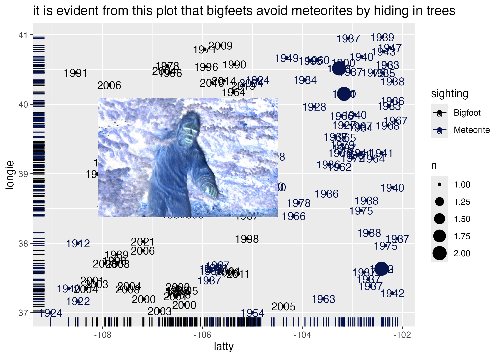
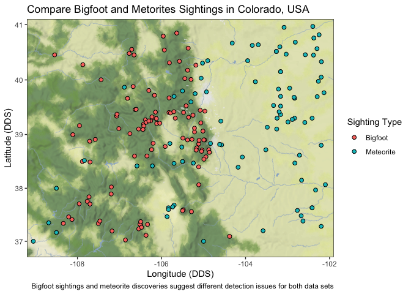

GoodPlot_BadPlot
================
kelli
2024-10-29

# Load Libraries

``` r
library(tidyverse)
library(here)
library(maps)
library(mapdata)
library(mapproj)
library(ggmap)
library(lubridate)
library(magick)
library(beyonce)
```

# Get Data

### Tidy Tuesday Data: Let’s Compare Metorite Discoveries and BigFoot Sightings.

Our class on maps made me wonder if other kinds of detection data are
skewed in Colorado because of the geography.

I decided to look at Bigfoot sightings *and* meteorite sightings.

``` r
meteorites <- readr::read_csv("https://raw.githubusercontent.com/rfordatascience/tidytuesday/master/data/2019/2019-06-11/meteorites.csv")

bigfoot <- readr::read_csv('https://raw.githubusercontent.com/rfordatascience/tidytuesday/master/data/2022/2022-09-13/bigfoot.csv')
```

# Clean up data

### Meteorite data

``` r
cleanm <- meteorites %>%
  filter(lat < 41.01805, #filter by Colorado's latitude
       lat > 36.98442) %>%
  filter(long < -102.0438, #filter by Colorado's Longitude
         long > -109.0625) %>%
  select(year, lat, long) %>%
  mutate(sighting= "Meteorite") %>% #make sure we can distinguish points when datasets are joined
  rename(latitude = lat, longitude= long)
```

### Bigfoot data

``` r
bigfoot$year <- year(ymd(bigfoot$date)) #extract the year using lubridate
cleanb <- bigfoot %>%
  filter(state == "Colorado")%>%
  select(latitude,longitude,year) %>%
  drop_na(latitude) %>%
  mutate(sighting = "Bigfoot")
```

# Join datasets and save a new file

``` r
points <- full_join(cleanb,cleanm)
write_csv(points, here("goodplot_badplot", "data","joinedpoints.csv"))
```

# Make a Bad Plot

``` r
footpic <- image_read("https://www.fortmorgantimes.com/wp-content/uploads/2023/12/thinkstockphotos-152533219.jpg?w=1575") %>%
  image_negate() %>%
  image_scale("500") %>%
  image_scale("x500")
```

``` r
badplot <- ggplot(data=points,
               aes(x= longitude,
                   y= latitude, color = sighting)) +
  geom_rug() +
  geom_count() +
  geom_text(label= points$year)+
  labs(title = "it is evident from this plot that bigfeets avoid meteorites by hiding in trees",
       x= "latty",
       y= "longie") +
    scale_color_manual(values = beyonce_palette(25))

  ggsave(here("goodplot_badplot","output","badplot.png"))

badplot<-image_read(here("goodplot_badplot","output","badplot.png"))

badplotperfect <- image_composite(badplot, footpic, offset = "+410+410")

image_write(badplotperfect, path = here("goodplot_badplot" , "output", "badplotperfect.png"), format = "png")

badplotperfect
```



## Reasons MSM will think this is a bad plot:

1.  While this plot does technically show what longitude and latitude
    you can find each type of sighting, it does a poor job connecting
    the two axes through the use of a rug plot, count dots, and year
    lables. An additional scatter plot layer would be helpful, I’m sure.
    Taking away some geom layers *might* provide clarity. The geom_count
    layer and geom_text layer are not helpful and clutter the visual
    with needless information.

2.  The color palette combination (while fabulous) is hard to
    distinguish and makes it difficult to compare meteorite and bigfoot
    sightings.

3.  There is a photo of a person in a bigfoot costume in the middle of
    the plot, making it difficult to see raw data. This photo is placed
    to convince you, using your heart more than your brain, that bigfeet
    are hiding in trees.

4.  “Latty” and “Longie” sound cute, but are vague terms that will
    confuse others. “N” as a legend label is not specific.

# Make a Good Plot

``` r
bbox <- c(left = -109.2, bottom = 36.7, right = -101.9, top = 41.1)

site_map <- ggmap(get_stadiamap(bbox, maptype = "stamen_terrain_background", zoom = 7))+ 
  geom_point(data = points, aes(x = longitude, y = latitude, fill = sighting), 
               pch= 21, size = 2, color = "black")+
              theme_bw() +
             labs(title="Compare Bigfoot and Metorites Sightings in Colorado, USA",
                  caption = "Bigfoot sightings and meteorite discoveries suggest different detection issues for both data sets",
       x= "Longitude (DDS)",
       y= "Latitude (DDS)") +
  guides(fill=guide_legend("Sighting Type"))  # add legend label

ggsave(here("goodplot_badplot" , "output", "Bigfootmeteorite.png"), width = 15, height = 15)
site_map
```

<!-- -->

## Reasons this is a good plot:

1.  This figure clearly shows where data points lie along longitudinal
    and latitudinal axes, and they are cleanly presented on a map of
    Colorado.

2.  Labels on the axes and legend are clear.

3.  The points can be compared to the topographic/geographic features in
    Colorado. Trees and Mountains are more green, Plains are more
    yellow. This figure suggests that Meteorites tend to be discovered
    in areas that have a higher visibility (plains), while Bigfoot
    sightings tend to be in areas with lower visibility (mountains and
    trees).

4.  This figure can show the limitations of detection for both data sets
    clearly, assuming that meteorites fall more uniformly than we detect
    them. Bigfeet are spotted less in areas of high visibility, possibly
    due to not existing. Conversely, meteorites do exist, but are
    discovered less frequently in areas with low visibility.

5.  It’s a little pixel-y isn’t it?
