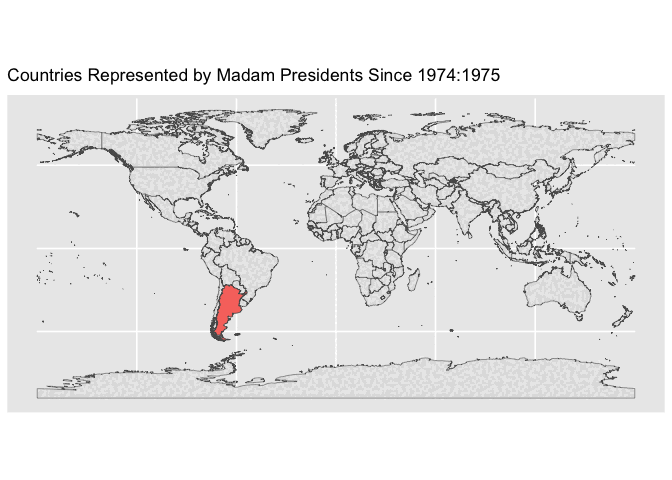

Tidy Tuesday: Democracy
================
kelli
2024-11-05

# Objective

I would like to make a map of all the female Presidents throughout time
and space (well, at least what is available from the tidy tuesday
dataset).

The new thing I will learn is how to use gganimate, because I have been
too much of a coward to use it.

## Libraries

``` r
library(tidyverse)
library(here)
library(gganimate)
library(sf) #helps with simple polygons
library(rnaturalearth) #use for map layer
library(rnaturalearthdata)
library(transformr) #internet told me this would help render the gif faster. Do I trust internet? 
library(lubridate)
```

## Load data

``` r
democracy_data <- readr::read_csv('https://raw.githubusercontent.com/rfordatascience/tidytuesday/master/data/2024/2024-11-05/democracy_data.csv')
```

## Ditchin’ the dudes

``` r
women <- democracy_data %>%
  filter( is_female_president == "TRUE", is_colony == "FALSE") %>%
  select(c("admin" = country_name, year, president_name))
women$year <- as.character(women$year)

women$admin[women$admin == 'Trinidad &Tobago'] <- 'Trinidad and Tobago' #rename
```

## Get the base map ready

``` r
world <- ne_countries(scale = "medium", returnclass = "sf")

world <- dplyr::select(world, admin, geometry) #I guess I have to override for the dplyr select? 
```

## Join datasets

``` r
joinF <-inner_join(world,women)

glimpse(joinF)
```

    ## Rows: 215
    ## Columns: 4
    ## $ admin          <chr> "Marshall Islands", "Marshall Islands", "Marshall Islan…
    ## $ year           <chr> "2016", "2017", "2018", "2019", "2018", "2019", "2020",…
    ## $ president_name <chr> "Hilda Hein", "Hilda Hein", "Hilda Hein", "Hilda Hein",…
    ## $ geometry       <MULTIPOLYGON [°]> MULTIPOLYGON (((169.6351 5...., MULTIPOLYG…

# Make an animation

``` r
animate <- ggplot() +
  geom_sf(data = world, size = 5) +
  geom_sf(data = joinF, aes(fill = admin)) +
  guides(fill = FALSE) +
  labs(title = 'Countries Represented by Madam Presidents Since 1974:{closest_state}') +
  transition_states(joinF$year, transition_length = 2, state_length = 4)
```

I had big dreams for this animation, but sometimes we don’t get what we
want.

## Save the .gif

``` r
animate
```

<!-- -->

It is fun to see more color pop up as we get into the 2010s! I want
more. MORE!

Listen. Yes. This looks bad. And I wanted to make labels with the
Presidents’ names. I could not get that to work. HOWEVER, I did FINALLY
get it to cycle through the countries by year and I will give myself a
little pat on the back for that. I faced my fears.
