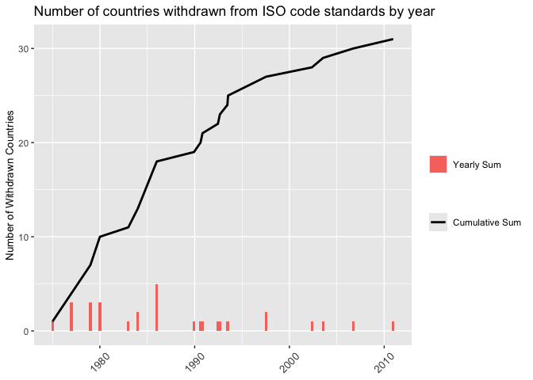

tuesday_02_countries
================
kelli
2024-11-11

## Load Libraries

``` r
library(tidyverse)
library(ggplot2)
library(janitor)
#install.packages("ISOcodes")
library(ISOcodes)
library(lubridate)
```

# \#triggered

I do not care about countries and their stupid codes in this month of
our lord November 2024.

This is because I want to dig a hole and lie face down until someone in
US government helps the environment or takes money away from creepy and
pasty billionaires so that less pasty people can have healthcare.

Anyway, I am going to put a bunch of quotes from *The English Patient*
by Michael Ondaatje now. Essentially, it’s about a guy who got all
burned up in Dub Dub Dos and then complained a lot that countries only
exist to create wars and hatred. I quote this book I barely remember
because the most mature way to process my anger is to be
passive-aggressive to the tidy tuesday dataset.

<center>
<h4>
“It’s only the rich who can’t afford to be smart. They’re compromised.
They got locked years ago into privilege. They have to protect their
belongings. No one is meaner than the rich. Trust me. But they have to
follow the rules of their shitty civilised world. They declare war, they
have honour, and they can’t leave. But you two. We three. We’re free.”
</h4>
</center>

I am going to see how many dead countries there are, and the rough rate
of dead countries over the years. I decided to do this because I lived
on Johnston Island for six whole months (post death as a country) and
that was enough to spur me onward.

## Get Data

``` r
former_countries <- readr::read_csv('https://raw.githubusercontent.com/rfordatascience/tidytuesday/master/data/2024/2024-11-12/former_countries.csv')
```

<center>
<h4>
“Do you understand the sadness of geography?”
</center>
</h4>

## Clean (suggested code from github)

``` r
former_countries <-
  ISOcodes::ISO_3166_3 |> 
  tibble::as_tibble() |> 
  janitor::clean_names()
```

## Create a modified dataset to plot

``` r
types <- former_countries %>% 
  mutate( date = (as.Date(sub("(^[0-9]{4}$)", "\\1-01-01", former_countries$date_withdrawn)))) %>% #Jesus CHRIST that took FOREVER to figure out. This looks for any rows that have four digits only (AKA a single year) and then adds 1-01-01 to it so you can use it as a date.
  select(name, date) %>%
  group_by(date) %>% 
  count( name= "date_count") #count the number of occurances per date
types[,"cum_countries"] <- cumsum(types$date_count) #cumulative sum the occurances
```

<center>
<h4>
“All I desired was to walk upon such an earth that had no maps.”
</center>
</h4>

## half-hearted graph showing annual country withdrawls and cumulative withdrawls over the dataset.

``` r
ggplot(types)  +  
  geom_bar(aes(x=date, y=date_count, fill = "Yearly Sum"),stat="identity", width = 100)+ 
  geom_line(aes(group = 1, x= date, y = types$cum_countries, color = "Cumulative Sum"), size = 1) +
  labs(title= "Number of countries withdrawn from ISO code standards by year", 
       x="Date",y="Number of Withdrawn Countries") +
  scale_color_manual(values = c("Cumulative Sum" = "black")) +
  labs(color = "", fill = "") +
  theme(
  axis.title.x = element_blank(),
  axis.title.y = element_text(size=10),
  axis.text.x = element_text(angle = 45, size=10, vjust = 0.5, hjust=0.5))
```

<!-- -->

Hi, Kelli here. Thanks for joining me. I am sorry you have to look upon
this snot-fueled pretentious group of quotes from a book I read in 10th
grade. It did help a little, though.

## New Things I learned

1.  I used count and cumsum functions!
2.  I made a new Stringr call to fix dates!
3.  I made a combo bar AND a line graph! WOW!
