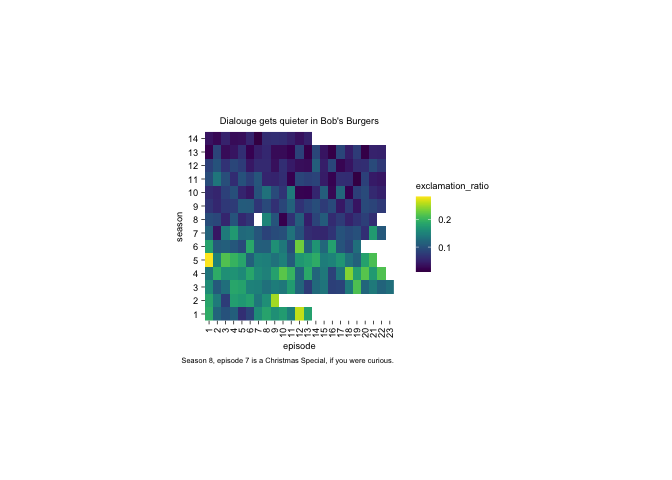

tuesday_04_burders
================
kelli
2024-11-26

## libraries

``` r
library(tidyverse)
library(tidyplots)
```

The new package I learned this week is tidyplots! Thank you for the last
minute shout-out, Dr. Silbiger.

## read in data

``` r
episode_metrics <- readr::read_csv('https://raw.githubusercontent.com/rfordatascience/tidytuesday/master/data/2024/2024-11-19/episode_metrics.csv')
```

``` r
episode_metrics %>%
  tidyplot(x = episode, y = season, color = exclamation_ratio) %>%
  add_heatmap() +
    scale_x_continuous(breaks = c(1:23),) +
  scale_y_continuous(breaks = c(1:14)) +
  labs(title = "Dialouge gets quieter in Bob's Burgers", caption ="Season 8, episode 7 is a Christmas Special, if you were curious.", guide_legend("exclamation point ratio per episode"))
```


