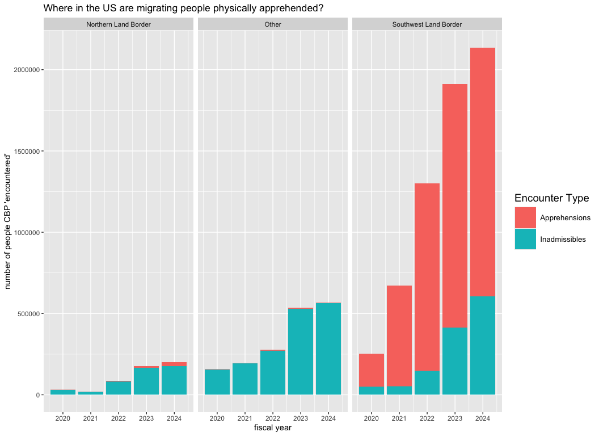
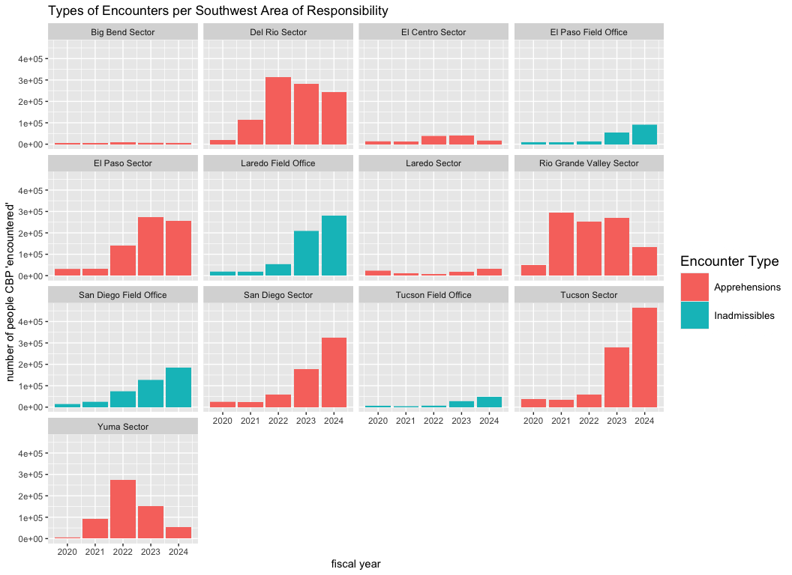

tuesday_05_ICE
================
kelli
2024-12-02

## Libraries

``` r
library(tidyverse)
#install.packages("gifski")
library(gifski)
library(gganimate)
```

## Read in data

``` r
cbp_resp <- readr::read_csv('https://raw.githubusercontent.com/rfordatascience/tidytuesday/master/data/2024/2024-11-26/cbp_resp.csv')
cbp_state <- readr::read_csv('https://raw.githubusercontent.com/rfordatascience/tidytuesday/master/data/2024/2024-11-26/cbp_state.csv')
```

## First Plot:

I want to see what each region looks like in terms of apprehensions
vs. inadmissibles. According to the CPB
[here](https://www.cbp.gov/newsroom/stats/cbp-enforcement-statistics/title-8-and-title-42-statistics-fy2021):

> Enforcement Actions refers to apprehensions or inadmissibles processed
> under CBP’s immigration authority. Inadmissibles refers to individuals
> encountered at ports of entry who are seeking lawful admission into
> the United States but are determined to be inadmissible, individuals
> presenting themselves to seek humanitarian protection under our laws,
> and individuals who withdraw an application for admission and return
> to their countries of origin within a short timeframe. Apprehensions
> refers to the physical control or temporary detainment of a person who
> is not lawfully in the U.S. which may or may not result in an arrest.”

The thing I am most interested in is where “Apprehension” efforts occur
more often per method of entry (Southwestern Border, Northern Border, or
“Other” assuming that is plane/ship). I am not as interested in title 42
because it is temporary, so I am going to filter out those results.

``` r
total_regions <- cbp_resp %>%
  filter(title_of_authority == "Title 8") %>%
  select(area_of_responsibility, demographic, land_border_region, fiscal_year, encounter_count, encounter_type) %>%
  group_by(demographic, land_border_region, fiscal_year, encounter_type) %>%
  summarize(total = sum(encounter_count)) %>%
  ggplot(
    aes(
      x = fiscal_year,
      y = total,
      fill = encounter_type)
    ) +
  geom_col(
    lwd = 0.25, #keep the column widths fairly thin
  ) +
  theme(
        legend.key.height = unit(1, 'cm'), #change legend key height
        legend.key.width = unit(1, 'cm'), #change legend key width
        legend.title = element_text(size=14), #change legend title font size
        legend.text = element_text(size=10)) + #change legend text font size 
  labs(title = "Where in the US are migrating people physically apprehended?",
       x = "fiscal year",
       y = "number of people CBP 'encountered'") +
  guides(fill=guide_legend(title='Encounter Type')) +
  facet_wrap(~land_border_region)
total_regions
```



Boy… seems like a lot more physical force is being used on the
southwestern border, then? Just hypothesizing, but I think that could
either be a function of more people crossing illegally, or it could be a
function of how much enforcement exists to catch people in each region.

I’m interested to see if all the border offices have increased
apprehension numbers as the years go on, or if that trend is different
based on office in charge.

``` r
categories <- unique(cbp_resp$area_of_responsibility) 
categories
```

    ##  [1] "Boston Field Office"        "Buffalo Field Office"      
    ##  [3] "Detroit Field Office"       "Seattle Field Office"      
    ##  [5] "Atlanta Field Office"       "Baltimore Field Office"    
    ##  [7] "Chicago Field Office"       "Houston Field Office"      
    ##  [9] "Laredo Field Office"        "Los Angeles Field Office"  
    ## [11] "Miami Field Office"         "New Orleans Field Office"  
    ## [13] "New York Field Office"      "Portland Field Office"     
    ## [15] "Preclearance Field Office"  "San Diego Field Office"    
    ## [17] "San Francisco Field Office" "San Juan Field Office"     
    ## [19] "Tampa Field Office"         "El Paso Field Office"      
    ## [21] "Tucson Field Office"        "Blaine Sector"             
    ## [23] "Buffalo Sector"             "Detroit Sector"            
    ## [25] "Houlton Sector"             "Spokane Sector"            
    ## [27] "Swanton Sector"             "Miami Sector"              
    ## [29] "Big Bend Sector"            "Del Rio Sector"            
    ## [31] "El Centro Sector"           "El Paso Sector"            
    ## [33] "Laredo Sector"              "Rio Grande Valley Sector"  
    ## [35] "San Diego Sector"           "Tucson Sector"             
    ## [37] "Yuma Sector"                "Grand Forks Sector"        
    ## [39] "Havre Sector"               "New Orleans Sector"        
    ## [41] "Ramey Sector"

Ugh, that’s quite a lot of offices.

Let’s just focus on the Southwest, since they have, by far, the most
apprehensions.

# Second Plot

I’d like to see if more single adults are apprehended, since I’ve heard
tell from people on TV that people STREAMING over the border are all the
“BAD ONES” and not families. I will make a little graphic showing
columns of apprehended folks by office, and then a breakdown of their
demographic status (Families (FMUA), Single adults, Unaccompanied
Children, or Accompanied Children).

``` r
filtered_data <- cbp_resp %>%
  filter(title_of_authority == "Title 8",
         land_border_region == "Southwest Land Border") %>%
  select(area_of_responsibility, demographic, citizenship, fiscal_year, encounter_count, encounter_type) %>%
  group_by(demographic, area_of_responsibility, fiscal_year, encounter_type) %>%
  summarize(total = sum(encounter_count))
```

``` r
plot <- filtered_data %>%
  ggplot(
    aes(
      x = fiscal_year,
      y = total,
      fill = encounter_type)
    ) +
  geom_col(
    lwd = 0.25,
  ) +
  labs(title = "Types of Encounters per Southwest Area of Responsibility",
       x = "fiscal year",
       y = "number of people CBP 'encountered'") +
  guides(fill=guide_legend(title='Encounter Type')) +
  theme(
        legend.key.height = unit(1, 'cm'), #change legend key height
        legend.key.width = unit(1, 'cm'), #change legend key width
        legend.title = element_text(size=14), #change legend title font size
        legend.text = element_text(size=10)) + #change legend text font size 
  facet_wrap(~area_of_responsibility)
plot
```

``` r
plot2 <- filtered_data %>%
  ggplot(
    aes(
      x = fiscal_year,
      y = total,
      fill = demographic)
    ) +
  geom_col(
    lwd = 0.25,
  ) +
    labs(title = "Demographics Encountered per Southwest Area of Responsibility",
       x = "fiscal year",
       y = "number of people CBP 'encountered'") +
  guides(fill=guide_legend(title='Demographic')) +
  theme(
        legend.key.height = unit(.75, 'cm'), #change legend key height
        legend.key.width = unit(.75, 'cm'), #change legend key width
        legend.title = element_text(size=12), #change legend title font size
        legend.text = element_text(size=8)) + #change legend text font size 
  facet_wrap(~area_of_responsibility)
plot2
```



I suppose my take away from this is that the rise in apprehensions is a
trend, but it is not a steadfast one. Also, that it looks like Areas of
Responsibility have different duties when it comes to “apprehending”
folks or just deeming them inadmissible.

I think it would be interesting to look A) where exactly these areas of
responsibility function and B) look at the funding allocated to each
office for apprehension efforts.

# New things I learned:

1.  new package “gifski” makes it easier to use animations in Rmarkdown–
    learned how to animate via chunk options
2.  learned how to resize the legends in a plot
3.  used the unique function to list out unique variables in a column
