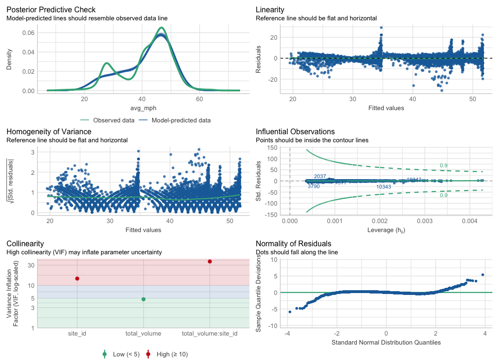
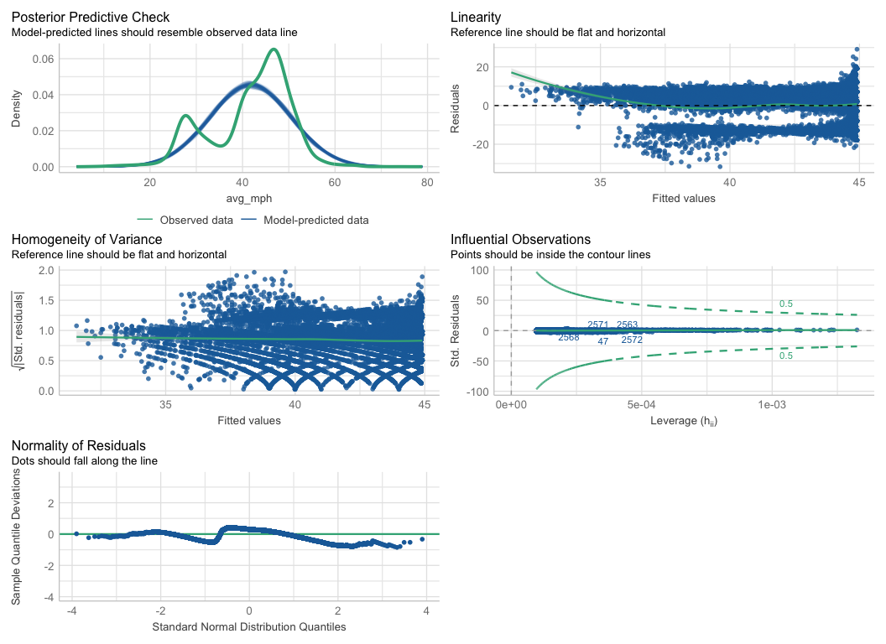

tuesday_06_traffic
================
kelli
2024-12-03

## Libraries

``` r
library(tidyverse)
library(janitor)
library(broom)
library(performance) 
library(modelsummary)
```

## R get data

``` r
A64_traffic <- readr::read_csv('https://raw.githubusercontent.com/rfordatascience/tidytuesday/main/data/2024/2024-12-03/A64_traffic.csv') %>%
  clean_names()
```

Okay, well, I’m gonna see if more cars means slower cars. How about
that?

``` r
A64_traffic$site_id <- as.character(A64_traffic$site_id)
plot <- ggplot(A64_traffic, aes(x= total_volume, y=avg_mph)) + 
    geom_point() +
  geom_smooth() +
  labs(title = "No Cars, Go? An Arcade Fire Fun Pun Title",
       y= "Average miles per hour",
       x= "Total cars recorded on the road")
plot
```


Boy that looks wonky.

I am just going to start by using the geom_smooth default function to
see if it picks up a difference in avg_mph ~ total volume \* site.

``` r
plot1 <- A64_traffic %>%
  ggplot(aes(x= total_volume, y=avg_mph, color = site_id)) + 
  geom_smooth() +
  labs(title = "No Cars? Go! An Arcade Fire Fun Pun Title",
       y= "Average miles per hour",
       x= "Total cars recorded on the road",
       col= "Site ID")
plot1
```


Fun!

I wonder if we can use a linear model to predict the relationship
between average speed and car volume by road site, since that might be a
factor?

*DISCLAIMER:* I have zero statistics experience, other than vaguely
pretending I know why it’s cool to see a low p value in a paper. Not
great!

I grew up in rural Colorado and there was no statistics class in high
school. I also convinced myself until I was about 28 that I had a
learning disability, so I avoided math at all costs. It turns out the
culprit was just anxiety and self-esteem issues, so now I can look all
math in the face again. Thank you therapy!

ANYWAY, this is all to say I am going to practice using the coding for
this, but I hope I will not be graded on my stat judgement! I am taking
Kyle’s class next semester, I promise I will learn.

Okay, fun! Kinda looks like there might be a negative relationship to me
(more cars ya got, the slower the cars go)

Now, for my new thing I learn, I want to try some of the linear model
packages we just learned about!

Here I am using the performance package to see if a linear model would
fit the data. I tried it using site as an interaction term.

``` r
car_mod<-lm(avg_mph ~ total_volume*site_id, data = A64_traffic)

check_model(car_mod) # check assumptions of an lm model
```


Ok. Well, I don’t know if this is a “good” enough fit. I am a little
worried about the Collinearity graph. It looks like maybe volume:site ID
Variance Inflation Factor is high. I am not sure what this means. Also,
I think the PPC looks okay, but I am not sure how much predicted
vs. observed should match before it’s considered an appropriate fit.
Linearity, Influential observations, and normality of residuals maybe
look okay?

Does it count as a Type… uh… I or II or III or 100 error if I try to see
the residuals for a model if I take the site out as an interaction? It
looks like the data doesn’t fit as well into an lm without it, other
than maybe having better homogeneity of variance.

``` r
car_mod1<-lm(avg_mph ~ total_volume, data = A64_traffic)

check_model(car_mod1) # check assumptions of an lm model
```



Try summaries:

interaction summary:

``` r
sumcarmod <- tidy(car_mod)
sumcarmod
```

    ## # A tibble: 8 × 5
    ##   term                     estimate std.error statistic   p.value
    ##   <chr>                       <dbl>     <dbl>     <dbl>     <dbl>
    ## 1 (Intercept)               34.8     0.0944       369.  0        
    ## 2 total_volume              -0.0615  0.000889     -69.1 0        
    ## 3 site_id7035               11.7     0.135         86.8 0        
    ## 4 site_id7042               13.6     0.137         99.4 0        
    ## 5 site_id7058               16.9     0.136        125.  0        
    ## 6 total_volume:site_id7035   0.0203  0.00123       16.4 7.77e- 60
    ## 7 total_volume:site_id7042   0.0353  0.00111       31.8 2.15e-212
    ## 8 total_volume:site_id7058   0.0235  0.00148       15.8 8.16e- 56

If site 6867 is the intercept, then this looks like the car volume as
well as the site is pretty significantly different?

``` r
anova(car_mod)
```

    ## Analysis of Variance Table
    ## 
    ## Response: avg_mph
    ##                         Df Sum Sq Mean Sq  F value    Pr(>F)    
    ## total_volume             1  83983   83983  8390.92 < 2.2e-16 ***
    ## site_id                  3 577282  192427 19225.85 < 2.2e-16 ***
    ## total_volume:site_id     3  10220    3407   340.37 < 2.2e-16 ***
    ## Residuals            10411 104202      10                       
    ## ---
    ## Signif. codes:  0 '***' 0.001 '**' 0.01 '*' 0.05 '.' 0.1 ' ' 1

No interaction Summary

``` r
sumcarmod <- tidy(car_mod1)
sumcarmod
```

    ## # A tibble: 2 × 5
    ##   term         estimate std.error statistic   p.value
    ##   <chr>           <dbl>     <dbl>     <dbl>     <dbl>
    ## 1 (Intercept)   44.9      0.121       372.  0        
    ## 2 total_volume  -0.0375   0.00105     -35.6 1.47e-261

``` r
anova(car_mod1)
```

    ## Analysis of Variance Table
    ## 
    ## Response: avg_mph
    ##                 Df Sum Sq Mean Sq F value    Pr(>F)    
    ## total_volume     1  83983   83983  1264.8 < 2.2e-16 ***
    ## Residuals    10417 691704      66                      
    ## ---
    ## Signif. codes:  0 '***' 0.001 '**' 0.01 '*' 0.05 '.' 0.1 ' ' 1

Hey, let’s compare the models!

``` r
models<-list("Model with interaction" = car_mod,
             "Model with no interaction" = car_mod1)
 #Save the results as a .docx
table <- modelsummary(models)
table
```

|  | Model with interaction | Model with no interaction |
|----|----|----|
| (Intercept) | 34.806 | 44.943 |
|  | (0.094) | (0.121) |
| total_volume | -0.061 | -0.037 |
|  | (0.001) | (0.001) |
| site_id7035 | 11.718 |  |
|  | (0.135) |  |
| site_id7042 | 13.585 |  |
|  | (0.137) |  |
| site_id7058 | 16.903 |  |
|  | (0.136) |  |
| total_volume × site_id7035 | 0.020 |  |
|  | (0.001) |  |
| total_volume × site_id7042 | 0.035 |  |
|  | (0.001) |  |
| total_volume × site_id7058 | 0.023 |  |
|  | (0.001) |  |
| Num.Obs. | 10419 | 10419 |
| R2 | 0.866 | 0.108 |
| R2 Adj. | 0.866 | 0.108 |
| AIC | 53577.6 | 73287.0 |
| BIC | 53642.9 | 73308.8 |
| Log.Lik. | -26779.813 | -36640.520 |
| F | 9584.227 | 1264.776 |
| RMSE | 3.16 | 8.15 |

Er, so, I know from a little bit of glmm work that AIC is an important
indicator for the appropriateness of a given model for your data. Is
that the same here? If so, the lower the AIC, the more appropriate the
model is. I know there are other factors but I am not quite sure what
they are yet.

Okay, finally, maybe I’ll try to make a coefficent plot like we did in
class.

``` r
modelplot(models) +
    labs(x = 'Coefficients', 
         y = 'Term names') 
```


Is this good, or is this bad? Are less Coefficents good??? Yes, right,
smaller effect size? I don’t know! I JUST DON’T KNOW!

I think this might have to be it for my tidy tuesday adventure. If this
model is appropriate, it does look like the amount of cars influences
the average mph. Can you imagine that? I will take my Nobel in the mail.

I might actually ask if we could walk through interpreting these
together, if you’d be willing to during office hours! I will probably
forget. I am sure I will be able to revisit this tidy tuesday ever so
fondly and remember a time I did not know how to prove more car go slow
using data.

## What I learned

I learned how to apply the performance, broom, and modelsummary packages
myself on a larger set of data! Whee! Whoo!
