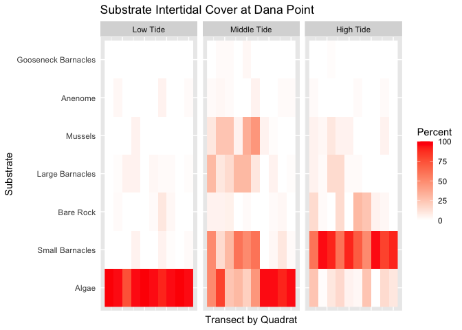

09B_homework
================
kelli
2024-11-02

# load libraries

``` r
library(tidyverse)
library(janitor)
library(here)
```

# load data

``` r
tidal <- read_csv(here("week_09", "data", "intertidaldata.csv"))
```

### clean data

``` r
dana <- tidal %>%
  clean_names() %>%
  select(site:anemone) %>%
  filter(site == "Dana Point") %>% #I pick Dana Point because that's around where my mom n dad grew up
pivot_longer(cols = bare_rock:anemone, #columns you want to pivot
               names_to = "Variables", #names of new columns with all the variables
               values_to = "Percent")
```

### manually reorder levels, change character

``` r
tide <- dana$quadrat %>%
  factor(c("Low", "Mid", "High"), levels = c("Low", "Mid", "High"))
```

Plot: different critters cover different percentages of low, medium, and
high intertidal zones

``` r
plot <- ggplot(dana, aes(transect,fct_reorder(Variables, Percent, .desc = TRUE), fill= Percent))+
  geom_raster() + 
  facet_wrap(tide, labeller = as_labeller(c(`Low` = "Low Tide", `Mid` = "Middle Tide",`High` = "High Tide"))) +
  scale_fill_continuous(low = "white", high = "red")+
  scale_y_discrete(labels= c(gooseneck_barnacles ="Gooseneck Barnacles", anemone = "Anenome", mussels = "Mussels", large_barnacles = "Large Barnacles", bare_rock = "Bare Rock", small_barnacles = "Small Barnacles", algae = "Algae"))+
  labs(title = "Substrate Intertidal Cover at Dana Point",
       x = "Transect by Quadrat",
       y = "Substrate") +
theme(axis.text.x = element_blank(), #I'm gonna get rid of the X axis ticks and numbers because I don't know that they mean anything important
  axis.ticks = element_blank()) 
plot
```



This took me a very long time and I do not know why
